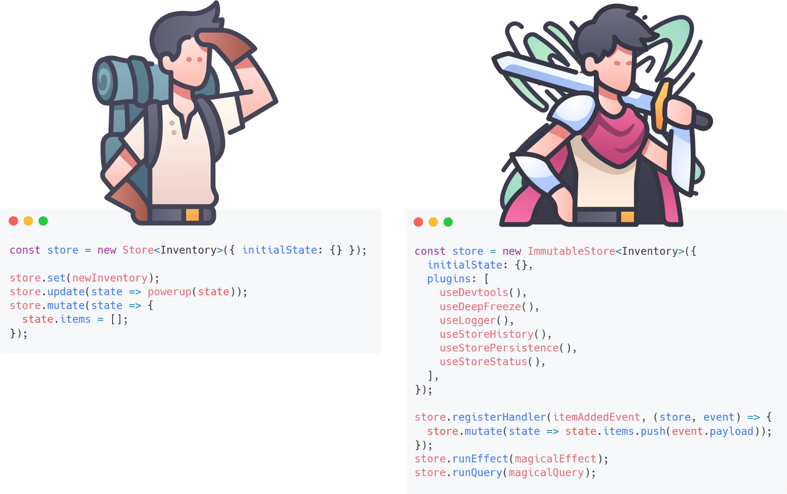

<h1 align="center">
  <a
    target="_blank"
    href="https://zuriscript.github.io/signalstory/"
  >
    
  </a>
</h1>
<p align="center">
  <b>Signalstory - Angular state management with signals</b>
</p>
<p align="center">
  <a
    href="https://zuriscript.github.io/signalstory/docs/prolog"
    target="_blank"
  ><b>Documentation</b></a>&nbsp;&nbsp;&nbsp;📚&nbsp;&nbsp;&nbsp;
  <a
    href="https://stackblitz.com/edit/stackblitz-starters-bjnmnr?file=src%2Fapp%2Fstate%2Fbooks.store.ts"
    target="_blank"
  ><b>Sample</b></a>&nbsp;&nbsp;&nbsp;🚀&nbsp;&nbsp;&nbsp;
  <a
    href="https://zuriscript.github.io/signalstory/"
    target="_blank"
  ><b>Website</b></a>&nbsp;&nbsp;&nbsp;🔥&nbsp;&nbsp;&nbsp;
  <a
    href="https://github.com/zuriscript/signalstory/releases"
    target="_blank"
  ><b>Release notes</b></a>&nbsp;&nbsp;&nbsp;✨&nbsp;&nbsp;&nbsp;
</p>

<div  align="center">

[](https://opensource.org/licenses/MIT)
[](https://badge.fury.io/js/signalstory)
[](http://commitizen.github.io/cz-cli/)
[]()
[]()
[](https://github.com/prettier/prettier)

</div>

signalstory is a state management library based on angular signals. It offers a range of architectural options, from simple repository-based state management (`signal-in-a-service`) to orchestrating decoupled commands, handling side effects through encapsulated objects, and facilitating inter-store communication using an event-driven approach. The ultimate goal is to provide a great user experience for all developers, whether junior or senior, while incorporating all the features you need to master your frontend state requirements.

> Starting out? You can keep it nice and simple if you prefer to avoid exploring all the advanced features that a state management library can offer! Begin by checking out the [store](https://zuriscript.github.io/signalstory/docs/store), and only dive into the rest if you're curious later on.

Here's a snapshot of some notable highlights:

✅ &nbsp;Signal-in-a-service approach  
✅ &nbsp;Simple, non-intrusive and lightweight  
✅ &nbsp;Optimized for Scalability  
✅ &nbsp;Imperative-first with Declaritive capabilities  
✅ &nbsp;Immutability on demand  
✅ &nbsp;Rich plugin ecosystem  
✅ &nbsp;Native IndexedDB support  
✅ &nbsp;Granular Undo/Redo
✅ &nbsp;Global State Snaphots and Rollbacks
✅ &nbsp;Devtools support  
✅ &nbsp;Effect and Store status tracking  
✅ &nbsp;Realtime store performance statistics  
✅ &nbsp;Custom plugin support  
✅ &nbsp;Built-in testing utilities  
✅ &nbsp;SSR friendly  
✅ &nbsp;Tree-shakeable

## Let the store grow with your project

<picture>
  <source media="(prefers-color-scheme: dark)" srcset="docs/static/img/code_evolve_landscape_dark.png">
  
</picture>

## Guiding Principles

- 🚀 Use class methods to provide controlled access and mutations to shared state.
- 🌌 If your store becomes too complex and bloated, slice it into multiple stores.
- ✨ Join and aggregate your state at the component level using signal mechanics.
- 🌐 Need to sync states between stores synchronously? - Use events.
- 🔮 Need to decouple actors and consumers as you do in `redux`? - Use events.
- 🔄 Craving `Immutability`? - Just activate it.
- 🏎️ Don't want full immutability because your store has to be super fast? - Don't activate it.
- 🧙‍♂️ Seeking a way to encapsulate side effects in a reusable, maintainable, and testable way? - Use effect objects.
- 🔍 Want a way to reuse and test queries spanning over multiple stores? - Use query objects.
- 📦 Don't want to use a class for stores? - You don't have to.
- 🛠️ Tired of debugging state changes in the console? - Enable redux devtools.
- 🪄 Still want some good old logging magic? - Enable Store logger plugin
- ⏳ Need to keep track of store history and perform undo/redo operations? - Enable the history plugin.
- 💾 Want to sync your state with local storage? - Enable the persistence plugin.
- 🗄️ Need a more sophisticated store storage or building an offline app? - Use IndexedDB adapter
- 📈 Need to get notified of whether your store is modified or currently loading? - Enable the Store Status plugin.
- 📊 Wondering where your bottlenecks are? - Enable the performance counter plugin
- 🎨 Something's missing? - Write a custom plugin.
- 📖 Read the [docs](https://zuriscript.github.io/signalstory/) for more features and concepts.

## Installation

Install the library using npm:

```shell
npm install signalstory
```

## Sneak peek

```typescript
import { produce } from 'immer';

// Fully immutable store class with immer.js for boosting immutable mutation performance
class BookStore extends ImmutableStore<Book[]> {
  constructor() {
    super({
        initialState: { ... },
        name: 'Books Store',
        mutationProducerFn: produce,
        plugins: [
          useDevtools(),
          useStoreHistory(),
          useStorePersistence(),
          useLogger(),
          useStoreStatus(),
          usePerformanceCounter(),
        ],
    });

    // Handle store reset request events
    this.registerHandler(storeResetRequestEvent, store => {
      store.set([], 'Reset');
    });
  }

  // Query
  public get getBooksInCollection() {
    return computed(() => this.state().filter(x => x isInCollection));
  }

  // Command
  public addToCollection(bookId: string) {
    this.mutate(state => {
      const book = state.find(x => x.id === bookId);
      if (book) {
        book.isInCollection = true;
      }
    }, 'Add Book To Collection');
  }
}


// Encapsulated multi store query object
export const BooksAndPublishersByAuthorInSwitzerlandQuery = createQuery(
  [BookStore, PublisherStore],
  (books, publishers, authorId: string) => {
    const booksFromAuthor = books.state().filter(x => x.author === authorId);
    const publishersInSwitzerland = publishers.state().filter(x => x.country === 'CH');

    return booksFromAuthor.map(book => ({
      book,
      publisher: publishersInSwitzerland.find(p => p.id === book.mainPublisherId),
    }));
  }
);
// And then run it
const query = myBookStore.runQuery(BooksAndPublishersByAuthorInSwitzerlandQuery, 'sapowski');

// Encapsulated effect object
export const fetchBooksEffect = createEffect(
  'Fetch Books',
  (store: BookStore) => {
    const service = inject(BooksService);
    const notification = inject(NotificationService);

    return service.fetchBooks().pipe(
      catchError(err => {
        notification.alertError(err);
        return of([]);
      }),
      tap(result => store.setBooks(result))
    );
  },
  {
    setLoadingStatus: true, // indicates that the store is loading while the effect runs
    setUnmodifiedStatus: true, // it should mark the store as unmodified upon completion
  }
);
// And then run it
myBookStore.runEffect(fetchBooksEffect).subscribe();
const loadingSignal = isLoading(myBookStore); // true while effect is running
const isModifiedSignal = isModified(myBookStore); // true after store update
```

## Sample Application

To set up and run the sample app locally, follow the steps below:

1. **Clone the repository:** Clone the repository containing the signalstory library and the sample app.

2. **Install dependencies:** Navigate to the root directory of the repository and run the following command to install the necessary dependencies:

   ```bash
   npm install
   ```

3. **Build the library:** Run the following command to build the signalstory library:

   ```bash
   ng build signalstory
   ```

4. **Serve the sample app:** Run the following command to serve the sample app locally:

   ```bash
   ng serve sample --open
   ```

---

   <p align="center">  
     
   </p>

   <p align="center">
   made with ❤️ by zuriscript
   </p>
